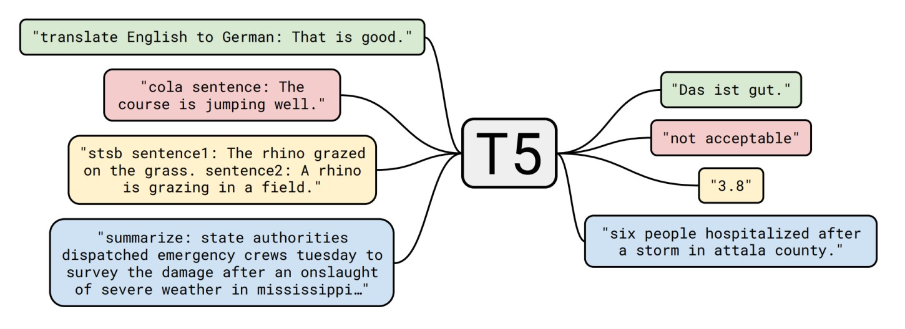

# Abstractive-Text-Summarization

The objective of the project was to summarize the given source text. This task was impleted by fine-tuning the existing T5 (Text-To-Text) transfer model. 

**Data**
- The dataset used was news-summary dataset from Kaggle:  
  https://www.kaggle.com/sunnysai12345/news-summary?select=news_summary.csv

- The dataset consists of ~4000 samples. It consist of  `Author_name, Headlines, Url of Article, Short text, Complete Article` columns.

**Model**

- Used the idea from Text Summarization with Pretrained Encoders paper to start with a pretrained transformers model and finetune it on our summarization dataset.
- Used T5 as our base language model. It is one of its kind transformers
architecture that converts NLP tasks to a text-to-text problem. Tasks such as translation, classification, summarization and question answering, all of them are treated as a text-to-text conversion problem, rather than considering them as separate unique problem statements. Following image shows kind of tasks where T5 can be used.

    

Please check the attached notebook and report for more details.
